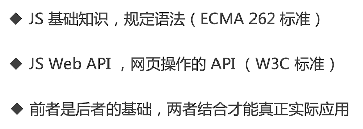
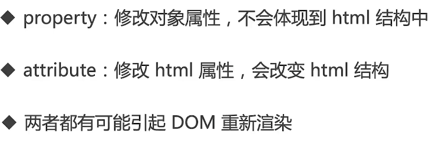
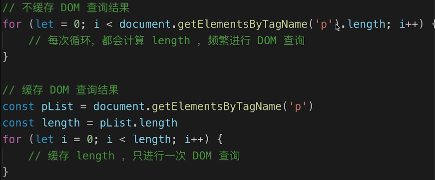

# JS-Web-API
概念：

API:
- DOM
- BOM
- 事件绑定
- Ajax
- 存储

常见问题：
- DOM 是哪种数据结构  
树（DOM 树） 树形结构
- DOM 操作的常用 API  
DOM 节点操作，DOM 结构操作，attribute 和 property
- attr（attribute） 和 property 的区别（attribute 提供api修改，property 通过属性进行修改）
- 一次性插入多个 DOM 节点考虑性能

知识点：
- DOM 本质（从HTML解析出来的一棵树）
- DOM 节点操作
- DOM 结构操作
- DOM 性能

## DOM 的本质是什么
- vue 和 React 的框架，封装了 DOM 操作

## DOM 节点操作
`property` 通过修改的是DOM元素的JS变量，不会对标签/节点产生影响
`sttribute` 设置了标签/节点的属性会对标签/节点产生影响

> 尽量用 property 操作 DOM

## DOM 结构操作
- 新增/插入节点
- 获取子元素列表，获取夫元素
- 删除子元素

```javascript
// 获取节点
const div1 = document.getElementById('div1')

// 新建节点
const p1 = document.createElement('p')
p1.innerHTML = 'this is p1'

// 插入节点
div1.appendChild(p1)

// 移动节点
const p1 = document.getElementById('p1')
div2.appendChild(p1) // 对现有节点，使用 appendChild 操作的话，就会发生移动，而不是新增插入

// 获取父元素
console.log(p1.parentNode)

// 获取子元素
const div1ChildNodes = div1.childNodes
console.log(div1.childNodes) // 这里获取的是一个 NodeList

const div1ChildNodesP = Array.prototype.slice.call(div1.childNodes).filter(child => {
  if (child.nodeType === 1) {
    return ture
  }
  return false
})

console.log('divChildNodesP', divChildNodesP) // 转为数组加以过滤后便可以获取到我们想要的子元素

// 删除元素
div1.removeChild(divChildNodesP[0])
```

## DOM 性能
- DOM 操作非常“昂贵”，避免频繁操作 DOM
- 对 DOM 查询做缓存
- 将频繁操作改为一次性操作  

DOM 查询做缓存


将频繁操作改为一次性操作

利用了文档片段