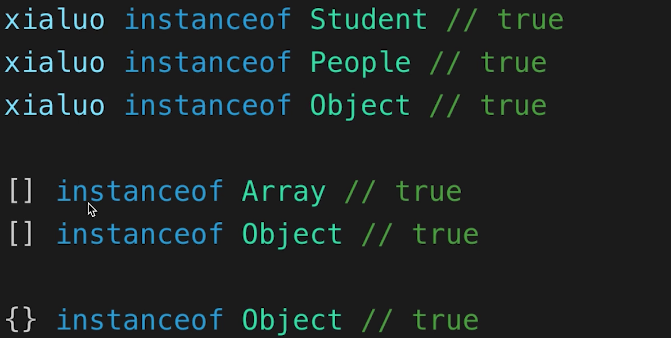
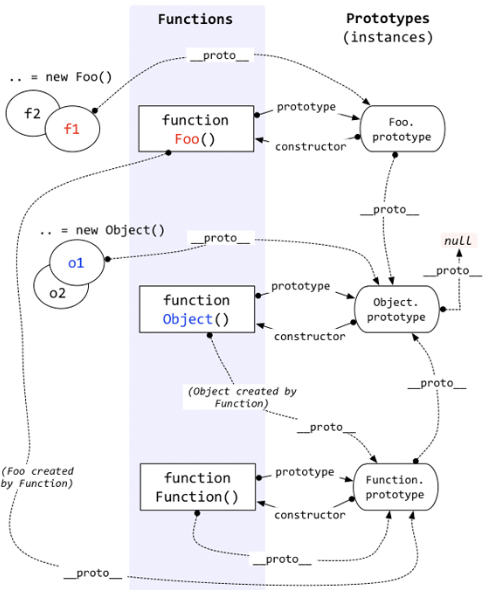
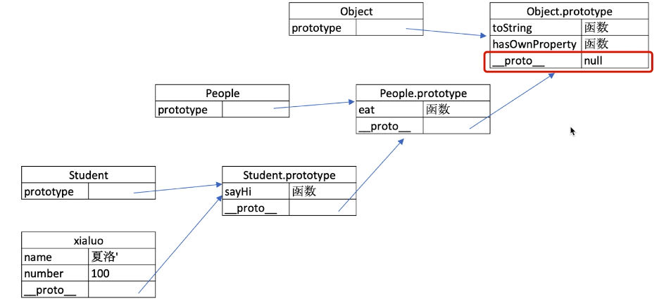

# 原型和原型链
## [class](https://developer.mozilla.org/zh-CN/docs/Web/JavaScript/Reference/Classes)
- class 是 ES6 语法规范，由 ECMA 委员会发布
- ECMA 只规定语法规则，即我们代码的书写规范，不规定如何实现
- 以上实现方式都是 V8 引擎的实现方式，也是主流的  
JavaScript 类实质上是 JavaScript 现有的基于原型的继承的语法,官方称之为“特殊函数”（`typeof class{}`结果为`"function"`），本质上是基于 JavaScript 现有的基于原型的继承的语法糖。  
包含的内容：
- constructor
- 属性
- 方法
```javascript
class Student {
  constructor (name, number) {
    this.name = name
    this.number = number
  }
  sayHi() {
    console.log(
      `姓名 ${this.name}，学号 ${this.number}`
    )
  }
}

// 通过类生成实例（对象）
const jack = new Student('Jack', 100)
console.log(jack.name)
console.log(jack.number)
jack.sayHi()

// ... 依据上面可以生成任意多的实例
```

## 继承 [extends](https://developer.mozilla.org/zh-CN/docs/Web/JavaScript/Reference/Classes/extends)
- extends
- [super](https://developer.mozilla.org/zh-CN/docs/Web/JavaScript/Reference/Operators/super)：在构造函数中使用，必须在使用`this`关键字之前使用。
- 扩展或重写方法
```javascript
// 父类
class People {
  constructor(name) {
    this.name = name
  }
  eat() {
    console.log(`${this.name} eat something`)
  }
}

// 子类
class Student extends People {
  constructor(name, number) {
    super(name) // 将父类中的 name 替换成这里的 name
    this.number = number
  }

  sayHi() {
    console.log(`姓名：${this.name} 学号 ${this.number}`)
  }
}
```
> 如果要添加内置方法的原型属性，最好先一步进行判断，该属性不存在，则添加。

## 类型判断 instanceof
`instanceof 表示一种继承关系，或者原型链的结构`

代码可以参考上面的内容，`xialuo`这个实例是 `Student` 类的实例，`Student` 继承了 `People` 类，`People` 是 `Objcet` 的子类。  
使用 `instanceof` 只要左边的对象是继承自右边（不一定是第一级继承），便返回 `true`。
### 混乱的继承关系？
```javascript
// 为什么？
Object instanceof Function
Function instanceof Object

// 因为！
Object.__proto__ === Function.prototype
Function.prototype.__proto__ === Object.prototype
```
上面理解起来很容易，就跟前面的笔记一样，**不一定是第一级继承**，因为`Object`是一个函数，函数都是由 Function 创建（`Object.__proto__ === Function.prototype`）也没什么好奇怪。`Function.prototype.__proto__ === Object.prototype`Function 的显示原型是对象，由 Object 创建。  


## 原型
**注意**：class 实际上是函数（语法糖）  
比如上面父类和子类：  
```javascript
typeof People // 'funciton'
typeof Student // 'funciton'
```
隐式原型和显示原型  
`xialuo`实例的隐式原型： `xialuo.__proto__`  
`Student`类的显原型： `Student.prototype`  
`xialuo.__proto__ === Student.prototype`  

### 原型分类
一般会把原型分为两类：
- 显式原型 `prototype`
- 隐式原型 `__proto__`  
#### 显式原型
显示原型（`prototype`）一般存在于函数中，就像上面注明的，其实 class 也是函数（[class实际上是一个“特殊的函数”](https://developer.mozilla.org/zh-CN/docs/Web/JavaScript/Reference/Classes))

#### 隐式原型
隐式原型（`__proto__`），一般存在于对象中。这个属性引用了一个显示原型`prototype`，这个引用的`prototype`来自创建这个对象的函数（例如：`obj.__proto__ === Object.prototype`，注意`typeof Object`结果是 `"function"`）。因为是引用，所以**不建议直接使用这个属性**。
### 原型关系
- 每个 **class**（或者函数） 都有**显式原型** `prototype`
- 每个**实例**都有**隐式原型**`__proto__`
- 实例的 `__proto__`指向对应 class 的 prototype  
总结来说就是，每个对象（实例）都有都有一个隐藏的属性`__proto__`，这个属性**引用**(指向)了创建了这个对象的函数(或者class)的`prototype`。即`fn.__proto__ === Fn.prototype`
### 基于原型的执行规则
- 获取属性 `xialuo.name` 或执行方法 `xialuo.sayHi()` 时
- 显在自身属性和方法寻找
- 如果找不到则自动去 `__proto__`中寻找

## 原型链
访问一个对象的属性时，先在基本属性中查找，如果没有，再沿着`__proto__`这条链向上找，这就是原型链。  
  
> 判断一个属性是否是实例自己的属性（是否有指定的键）可以用 Object.prototype.hasOwnProperty()  
  
每个对象都是继承于 Objcet，也就是说每个对象原型链的终点都是 Object，因为 Objcet 的**显示原型（`prototype`）的隐式原型（`__proto__`）**指向的是 `null`，即：
```javascript
Object.prototype.__proto__ === null
```
### 函数的原型和原型链
Function （注意大写开头）也是一个函数，函数是一种对象，也有 `__proto__`属性。既然是函数，那么一定是被 Function 创建。所以会出现`Function.__proto__ === Function.prototype` 这种自己创建自己的环形结构。  
`typeof Function.prototype.__proto__`结果为`"object"`，因为是对象，所以指向的是`Object.prototype`，原型链直到`Object.prototype.__proto__`引用`null`为止。

### 判断是基本属性还是原型链上的属性
使用 [`hasOwnProperty`](https://developer.mozilla.org/zh-CN/docs/Web/JavaScript/Reference/Global_Objects/Object/hasOwnProperty)，这个方法来自于`Object.prototype`:
```javascript
Object.prototype.hasOwnProperty
```
所以每个对象都有`hasOwnProperty`这个属性，原型链会顺着`__proto__`找到`Object.prototype`，所以便继承了它的方法。
