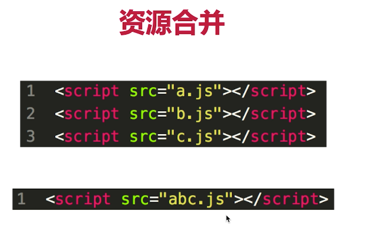
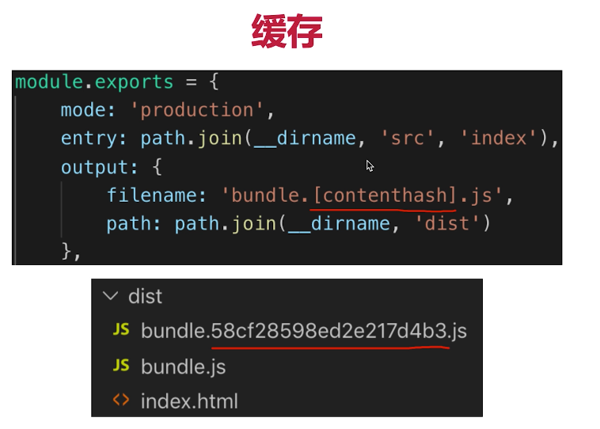
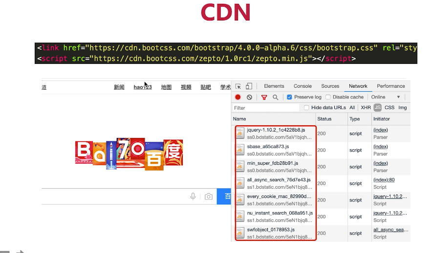
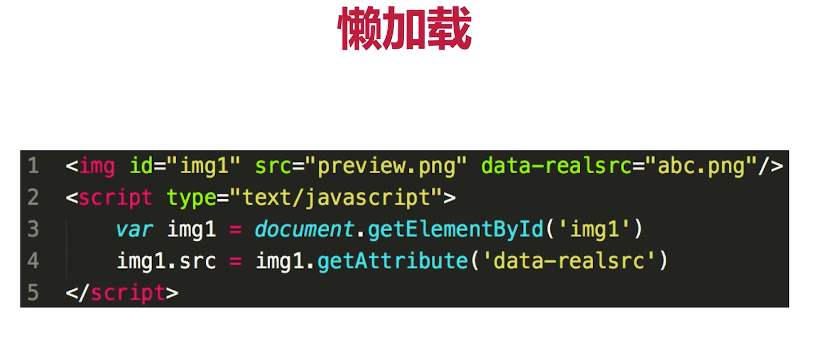

# 运行环境
## JavaScript 的运行环境
- 通常只运行在客户端（浏览器端，Nodejs可以运行在 server 端）
- 下载网页代码，渲染出页面，期间会执行若干 JS
- 要保证代码在浏览器中：稳定且高效

## 运行环境的应用优化
- 网页加载过程
- 性能优化
- 安全

## 网页加载过程
### 典型题目
- 从输入 url 到渲染出页面的整个过程
- window.onload 和 DOMContentLoaded 的区别

### 知识点
- 加载资源的形式
- 加载资源的过程
- 渲染页面的过程

#### 网页是如何加载并渲染出来的
##### 资源的形式（第一个知识点）
- html 代码
- 媒体文件（图片，视频等）
- javascript css

##### 加载过程（第二个知识点）
- DNS（domain name server） 解析：域名 -> IP 地址（口述就是：域名解析到ip地址）
- 浏览器根据 IP 地址向（通过系统的网络服务）服务器发起 http 请求
- 服务器处理 http 请求，并返回给浏览器
> 以上每个过程都可以展开说，包括三次握手四次挥手之类的计算机网络基础的内容，[具体参考](https://hit-alibaba.github.io/interview/basic/network/TCP.html)

##### 渲染过程 - 1（第三个知识点）
- 根据 HTML 代码生成 DOM Tree
- 根据 CSS 代码生成 CSSOM（css object model）
- 将 DOM Tree 和 CSSOM 整合（合并）成 [Render Tree](https://developers.google.com/web/fundamentals/performance/critical-rendering-path/render-tree-construction?hl=zh-cn)
> 在网页加载中发现css文件都会重新render，所以为了避免我们重复渲染，我们都将 css 文件放在 head 中

##### 渲染过程 - 2
- 根据 Render Tree 渲染页面
- 遇到 `<script>` 则暂停渲染，优先加载并执行 JS 代码，完成再继续
- 直至把 Render Tree 渲染完成
> 因为 JS 可能会改变我们已经渲染的 DOM 结构，所以会优先运行 JS
> 为了防止 DOM 渲染速度缓慢，一般将 JS 文件引入放在最后，让 DOM 先渲染完

##### window.onload 和 DOMContentLoaded
```javascript
window.addEventListener('load', function() {
  // 页面的全部资源加载完才会执行，包括图片、视频等
})

document.addEventListener('DOMContentLoaded', function () {
  // DOM 渲染完即可执行，此时图片、视频还可能没有加载完
})
```

## 性能优化
### 思路
- 是一个综合性问题，没有标准答案，但是要尽量全面（一套方案）
- 细节要知悉：手写防抖，节流（体验型的优化方案，定时器的使用）

### 性能优化原则
多用什么少用什么
- 多使用内存、缓存或其他方法
- 减少 CPU 计算量，减少网络加载耗时
- (适用于所有编程的性能优化 —— 空间换时间：例如 Chrome 标签页放在单独进程中，不过也要参考时代和设备基础)

### 从何入手
- 让加载更快
- 让渲染更快
#### 让加载更快
- 减少资源体积：压缩代码（例如 webpack production mode 生成的代码）
- 减少访问次数：合并代码（将多个JS放在一个JS中，这样只有一次网络请求。webpack 会合并代码，资源类型媒体类型文件亦可以合并，例如图片可以使用雪碧图Sprites），SSR 服务器端渲染（服务端处理好数据和请求一次给客户端）、缓存
- 使用更快的网络：CDN

#### 让渲染更快 - 1
- css 在 head，js 在 body 最下面
- 尽早开始执行JS，用 DOMContentLoaded 触发
- 懒加载（图片懒加载，上滑加载更多）


#### 让渲染更快 - 2
- 对 DOM 查询进行缓存
- 频繁 DOM 操作，合并到一起插入 DOM 结构
- 节流 throttle 防抖 debounce


#### 前端性能优化示例

例如 Webpack 就至少会将全局 JS 文件打包进一个 JS 文件中，以减少网络请求


`[contenthash]`
- 静态资源加 hash 后缀，根据文件内容计算 hash
- 文件内容不变，则 hash 不变，则 url 不变
- url 和文件不变，则会自动触发 [http 缓存机制](https://developer.mozilla.org/zh-CN/docs/Web/HTTP/Caching_FAQ)（客户端缓存），返回 304
> 尽可能在开发的时候命中这个缓存机制


#### CDN

> CDN 也会命中缓存机制

#### SSR
- 服务端渲染：将网页和数据一起加载，一起渲染
- 非 SSR（前后端分离）：先加载网页，再加载数据，再渲染数据
- 先前利用PHP JSP ASP等服务器脚本也是和SSR达成了相同的效果，在经历了前后端分离的时代之后，回归到了服务端渲染来，只是这次和以前我们接触PHP之类的服务器脚本并且应用其模板渲染页面有一定的差别

#### 懒加载

需要的时候在进行加载，而不是一次性加载完毕。

#### 查询 DOM 缓存

先获取 DOM 列表存于变量中再用JS进行循环查询

#### 多个 DOM 操作一起插入到 DOM 结构

使用[DocumentFragment](https://developer.mozilla.org/zh-CN/docs/Web/API/DocumentFragment)来创建文档片段（DocumentFragment不是真是 DOM 数的一部分，不会触发 DOM 树的重新渲染，且不会导致性能问题）

#### 尽早开始 JS 执行

使用 DOMContentLoaded 来执行JS，此时 DOM 已经渲染完成。